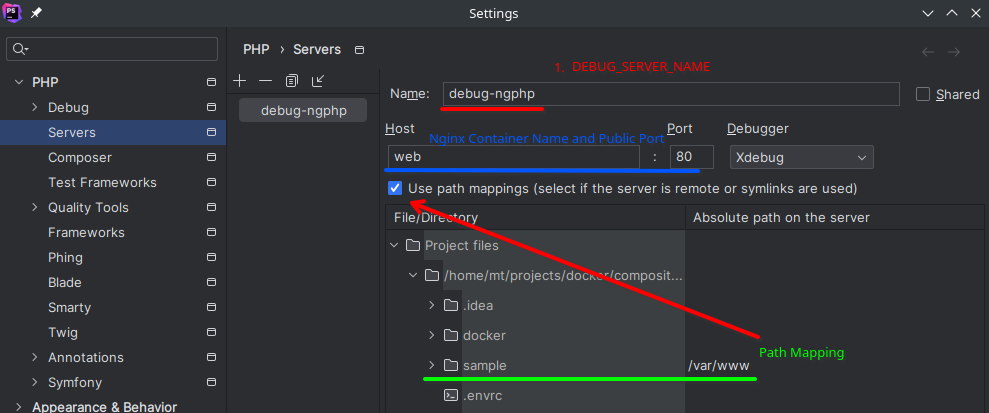

# NG-PHP

This project holds a simple docker compose config for an Nginx web-server with PHP.
It's the base for many of my PHP projects (vanilla php and symfony).

## Requirements

Docker has to be installed and Docker Compose should be installed as Module.

I am working with Direnv. You have to install it for your System and activate the local
`.envrc` file in after editing it.

I only tested on Linux (Arch/Manjaro). 
If there are any Problems, please let me know or make a 
Pull Request for this file with a description and a solution.

## Setup

1. copy the `.envrc.sample` to `.envrc`, edit and activate it.
2. Have a look on the `compose.yml` and modify with your changes. 
3. Simply run `docker compose up -d --build` to set up.
4. Open the Start Page in your Browser

If it is not working like expected, have a look on the docker container
logs during setup.

### enable XDebug in Jetbrains PHP-Storm

1. set the environment variables `XDEBUG_SESSION` 
  and `DEBUG_SERVER_NAME` in your `.envrc`. 
  Activate the variables via `direnv allow`.
2. IDE Settings
  - Settings -> PHP -> Xdebug -> Debug Port = add Port 9003 if not set
  - Settings -> PHP -> Servers = Add a new Server
    - the Server Name must be identical to the `DEBUG_SERVER_NAME` env variable
    - the host name should be the container name (`php`)
    - the host must be the exposed web port (i.e. `80`)
    - activate path mappings. In the sample you must set the local `./sample` 
      folder to the mapping `/var/www`

(you can find a screenshot for the server settings in the sample folder)

### Copyright

All files in the project folder are part are under copyright 2024 
by Maik Tizziani (mtizziani@gmail.com).

### Licence

This project is licenced under the LGPLv3. You can find information about
the licence in the files `COPYING` and `COPYING.LESSER` in 
the base directory of the project.

